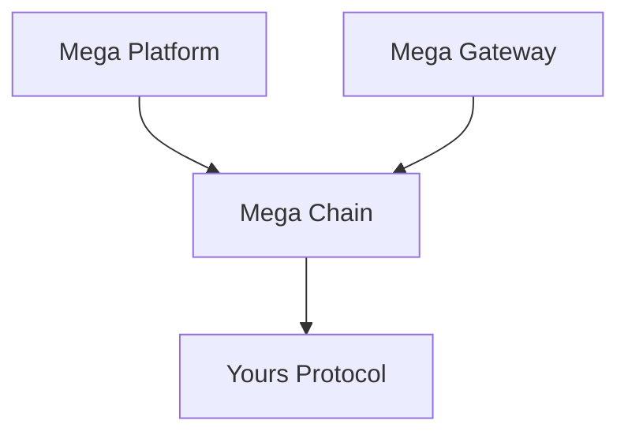

---
layout:
  title:
    visible: true
  description:
    visible: false
  tableOfContents:
    visible: true
  outline:
    visible: true
  pagination:
    visible: true
---

# Components

* **Yours Protocol i**s a standard for token metadata. Yours Protocol come in the form of a blockchain library that you pull into your code as a dApp developer. The protocols primary goals are to provide tokens with high performance, dynamic and flexible on-chain metadata.
* **Mega Chain p**rovides functionality and storage for tokens that currently do not reside on a specific dapp. It is the entrypoint for tokens that are imported from the ERC721 standard. Mega Chain is a central token hub with paths to multiple dapps.
* **Mega Platform i**s a user-friendly interface for interacting with the Mega Chain. The platform is an interface for the NFT Creators, Developers and Traders.
  * **NFT Creators** are via the platform able to create & mint tokens.
  * **Developers** are able to build modules which attaches logic to existing tokens.
  * **Traders** are able to see their tokens and trade them.
* **Mega Gateway s**erves a key purpose when dealing with metadata. It is responsible for gathering off-chain metadata when importing an ERC721 token to the Mega Chain. Additionally, it enables metadata on Mega Chain to be used for ERC721 tokens, which gives a NFT creator the option to still attach on-chain logic to their ERC721 collection.
* **MegaYours** is the framework which wraps the entire solution, providing developers & users with a new evolution of tokens on the blockchain.

##
