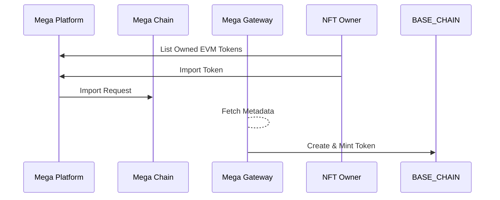
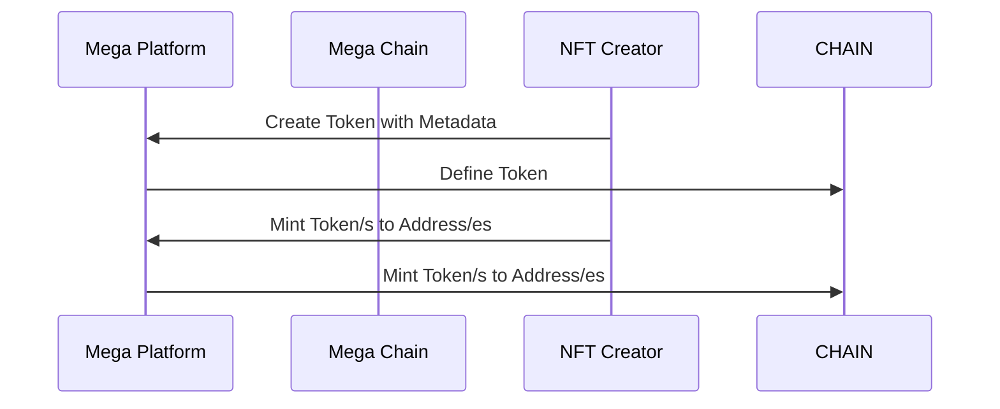
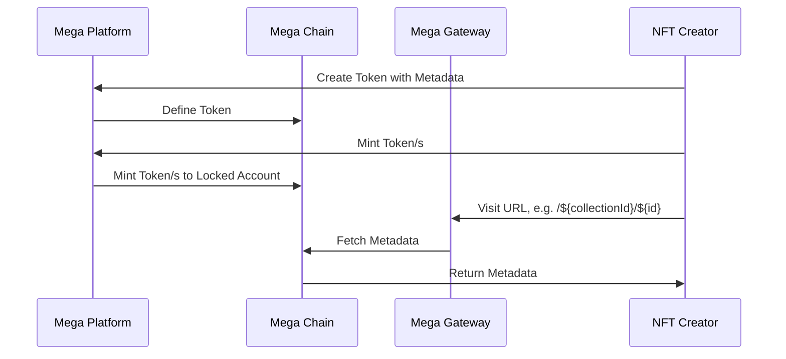

---
layout:
  title:
    visible: true
  description:
    visible: false
  tableOfContents:
    visible: true
  outline:
    visible: true
  pagination:
    visible: true
---

# Workflows

## Import ERC721 Token

## Token Creation

It's important to note that all tokens in Yours can have metadata attached to them. This means they all fungible tokens are actually semi-fungible tokens.

The determining factor if a token is non-fungible or semi-fungible is just a matter of how many tokens have been minted of it. If just 1 token is minted from each token, then it is considered non-fungible.

## On-chain Metadata for ERC721 Tokens

One use-case that we support is to mint tokens on any EVM chain but have the metadata on Yours.

These tokens can later easily be bridged to Yours so that the tokens can utilize on-chain metadata.

