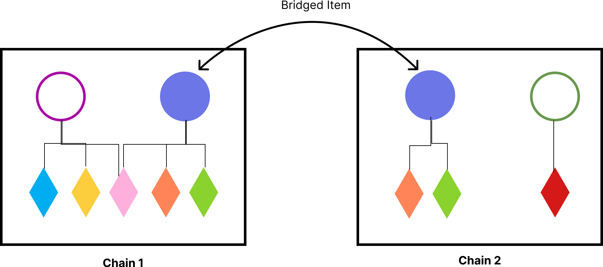

# Extending your on chain data

## I don't care, I just want to start

Look no further.


[setting-up-your-project.md](../yours-protocol/getting-started/setting-up-your-project.md)


Otherwise, welcome to the rabbit hole.

## Intro

Mega Yours aims at decentralized as much data as possible and, at the same time, to give control to the owner of those data. That is, creating an API-like system for developers and owners where developers can extend the functionalities of a set of information owned by a user (a.k.a. data, digital assets) and the user can see the utility of its data grow.&#x20;


#### ELI5

* Unique information on your blockchain are almost never _really_ on blockchain.
* Usually they are on decentralized storage facility such as IPFS.
* IPFS cannot mutate data (with or without blockchain).
* MegaChainl is a technology that allows data to be stored on the blockchain and gives the possibility to change those data. All of this on chain.



## The "Why"

We see a world where digital assets will be ubiquos: used in gaming, but also industrial application, DeFi, RWA, DePIN, logistic, record of information, access management and much more.

Digital assets are your belongings in the digital space.

We realized that all the information associated to a digital asset are often not on chain.&#x20;

So we wanted to put remedy to it.

## The "How"

We had to look into the bigger picture in order to solve the challenge, in particular: "What will be the Web3 space in the next 10 years?"

We realized that one limitation of the blockchain world is relying on _single thread chains_ meaning that transactions cannot happen simultaneously. There are many solutions that are being developed: new L1 and new L2 but the short summary is that - similar to web2 where each application has its own server(s) - each decentralized application (dapp) will have its own chain(s).

Therefore one of the questions the industry are asked to answer is "How do we move data between chains?" **Bridges were the answer**.

However bridges do not transfer the logic that is attached to the data that are represented. As an example, you can bridge an Ether token to Polygon, but it will lose its utility of gas unit.

We therefore created a protocol that is able to transfer the data (and metadata) representation between chains and is able to re-use the decentralized logic that is hosted on each chain it is imported into.

As an example:

The data contained in the blue asset can be easily migrated into chain2 but not the decentralized logic that governs it (the rhomboid).

<figure><figcaption></figcaption></figure>

## Architecture

### One Dapp (at least) One Chain Principle

We believe that in order to achieve the future needs, each dapp will require _at least_ a full CPU to run.

Today's applications runs on hundreds of servers (think about Meta, X, Uber), so we need to design an architecture that allows to scale within the same order of Magnitude

<figure><figcaption>
Architectural diagram
</figcaption></figure>

We have a _coordination chain_ called Yours Chain

