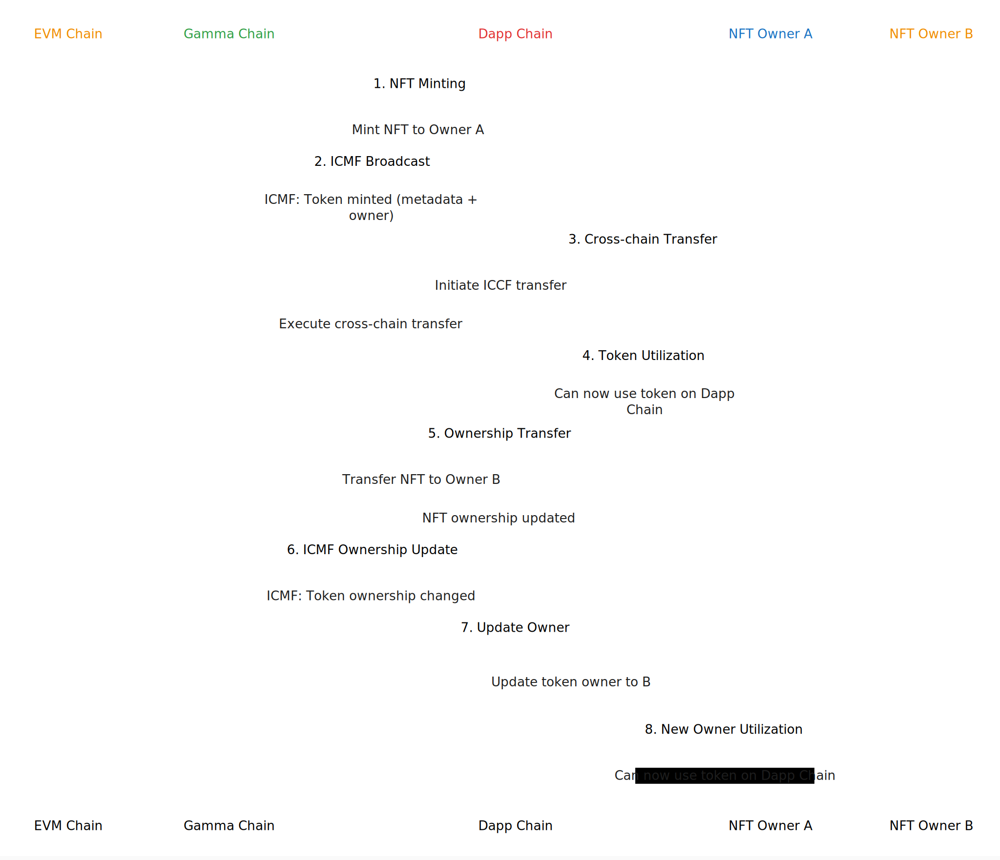

# 👾 Import Existing Tokens from any Chain

### The Challenge with Traditional NFT Bridging

Most valuable NFTs reside on EVM chains like Ethereum, Polygon, and Binance Smart Chain. Traditionally, to use these NFTs in different applications, owners must deposit their tokens into bridge contracts.&#x20;

Users and token holder don't like this approach, some of the reasons are:

1. **Security Concerns:** Users are often hesitant to deposit valuable NFTs into unfamiliar contracts
2. **Limited Utility:** Tokens locked in one bridge contract cannot be used simultaneously in other applications
3. **Cost Inefficiency:** Frequent deposits and withdrawals across different dapps result in high gas fees
4. **Complexity:** Managing multiple bridge interactions creates a poor user experience
5. **Management:** having tokens on different chains means that is more likely to lose them
6. **Liquidity:** tokens sparse on several chains limit access to liquidity, drawing the price down.

### MegaYours Solution

MegaYours introduces a seamless approach to NFT utility without requiring token deposits or transfers:

**Key Features**

1. **Non-Custodial:** NFTs remain on their original chains, maintaining security and owner control
2. **Multi-Chain Support:** Compatible with (for now) EVM chains including:
   1. Ethereum
   2. Polygon
   3. Binance Smart Chain
   4. Do you need another chain? [Contact us](https://forms.gle/SKSN5ENB6tZhQTPU6).

### Technical Implementation

**Gamma Chain Broadcasting:** MegaYours broadcasts ownership and metadata updates to Chromia dapps through the Gamma Chain

**Plug-and-Play Integration:** Dapps using Yours Protocol receive automatic token synchronization by subscribing to Gamma Chain events

**Minimal Configuration:** No manual bridging or syncing required by dapp developers

**Real-Time Updates:** Instant reflection of ownership changes and metadata updates across all integrated applications

The following sequence diagram illustrates how this system operates:

<figure><figcaption></figcaption></figure>

For more details on configuration and the use of external tokens, see:


[external.md](../yours-protocol/modules/external.md)

