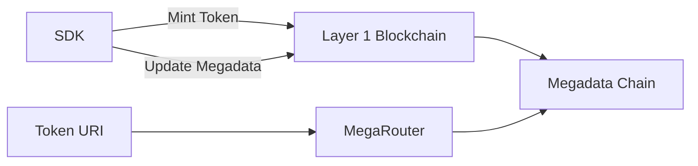

# 💾 Megadata

## Overview

Megadata is an easy-to-integrate alternative to static storage solutions such as IPFS and Arweave. It enables on-chain dynamic data that can evolve over time through on-chain logic for assets minted on any chain, including both Ethereum and Solana virtual machines (VMs). All logic is managed in a completely decentralized manner, and the only requirement for the external token creation interface is to offer Megadata as an option for metadata storage during the minting process.

By utilizing Megadata for metadata storage, developers can store and manage metadata on-chain while extending it at any time by attaching non-intrusive Modules. These Modules can incorporate various types of data, from 3D assets to multimedia and legal terms and conditions, as well as logic that defines asset behavior or utility within DApps implementing such Modules—without altering the original asset.

Megadata can also be attached to existing tokens using IPFS, Arweave, or any metadata URI through our MegaRouter gateway. This allows existing collections with static metadata to be seamlessly converted into dynamic metadata.

## Links

* [Github](https://github.com/megayours/megadata-sdk)
* [NPM](https://www.npmjs.com/package/@megayours/megadata)
