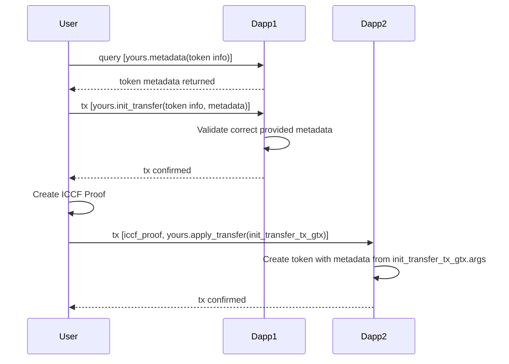

---
layout:
  title:
    visible: true
  description:
    visible: false
  tableOfContents:
    visible: true
  outline:
    visible: true
  pagination:
    visible: true
---

# 🔗 Interoperability

## Providing Additional Utility

In Yours Protocol tokens are interoperable because there is an agreed upon schema of how metadata looks like for a token, see [Metadata](metadata.md) for reference.

The receiving blockchain will receive the metadata for the imported token and can choose to react on it or not by extending the function `yours.after_apply_transfer` in its modules.&#x20;

This means that you can add additional logic and utility to a token by creating a new module and attaching it to the token, see [Modules](modules/attaching-modules.md) for reference.

## Re-using Modules on Another Blockchain

Modules are also designed to be shared and re-usable. If **Blockchain A** creates a module called `equippables`. Then **Blockchain B** can import that module and re-use the exact same utility on its blockchain.

The way it works is that the equippables module would extend `yours.after_apply_transfer` and populate its own entities if the token supports its module.

```kotlin
// equippables/extensions.rell
@extend(yours.after_apply_transfer)
function after_apply_transfer(yours.token, modules: set<name>, properties: map<text, gtv>) {
  if (not modules.contains("equippables")) return;
  
  // Here the dapp module equippables persists the metadata
  // that it is insterested in according to its needs.
  val equippable = equippable @? { token } ?: create equippable ( token );
  val slots = list<name>.from_gtv(attributes.get("slots"));
  for (slot in slots) {
    val _ = occupying_slot @? { equippable, slot } ?: create occupying_slot ( equippable, slot );
  }
}
```

Yours Protocol will always persist the metadata, so that metadata that was incoming can be transmitted to other blockchains as outgoing, even if the dapp persisted the metadata on its side or not.&#x20;

For example, **Blockchain A** might have attached an additional module to the token that **Blockchain B** doesn't care about. The metadata associated with that additional module would then be persisted by Yours Protocol behind the scenes on **Blockchain B**.

## Bridging



MegaYours will provide a TypeScript client which helps you do the above in a simple function call.
