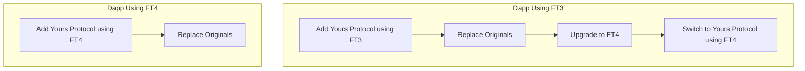

---
layout:
  title:
    visible: true
  description:
    visible: false
  tableOfContents:
    visible: true
  outline:
    visible: true
  pagination:
    visible: true
---

# FT3

Yours Protocol is based on FT4. However, we do provide a slimmed down version of Yours Protocol without cross-chain support which makes it easier to migrate for projects still using FT3.

The version with FT3 can be found on the `ft3` branch: [https://github.com/megayours/yours-protocol/tree/ft3](https://github.com/megayours/yours-protocol/tree/ft3)

